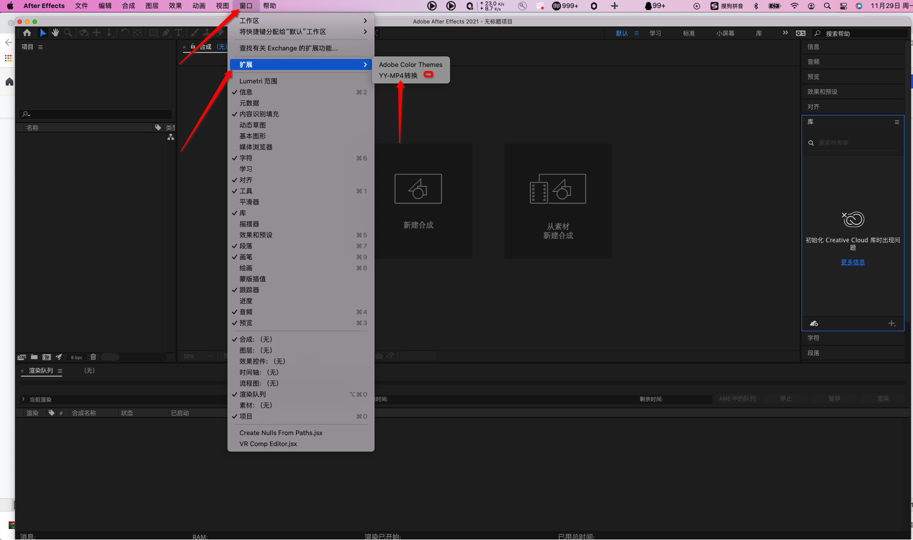
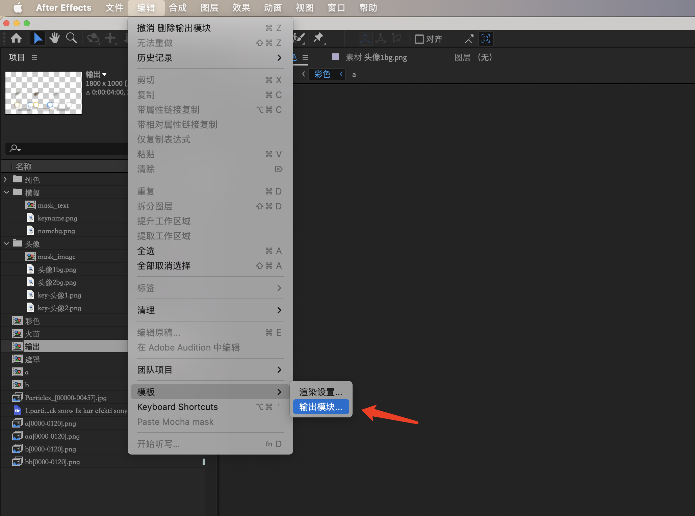
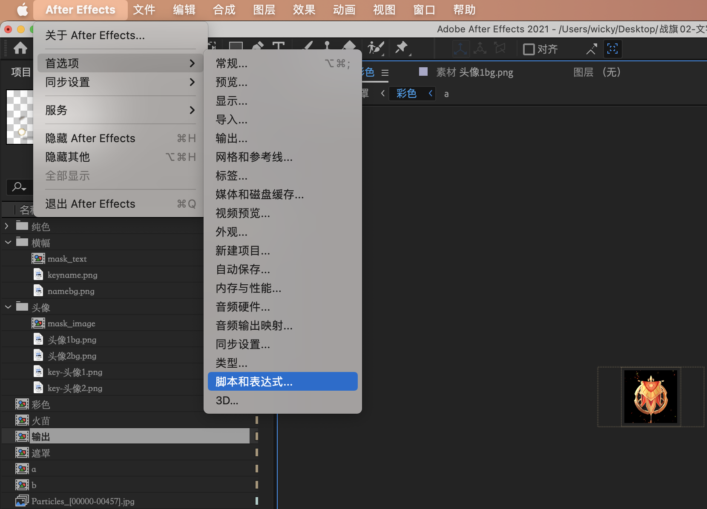
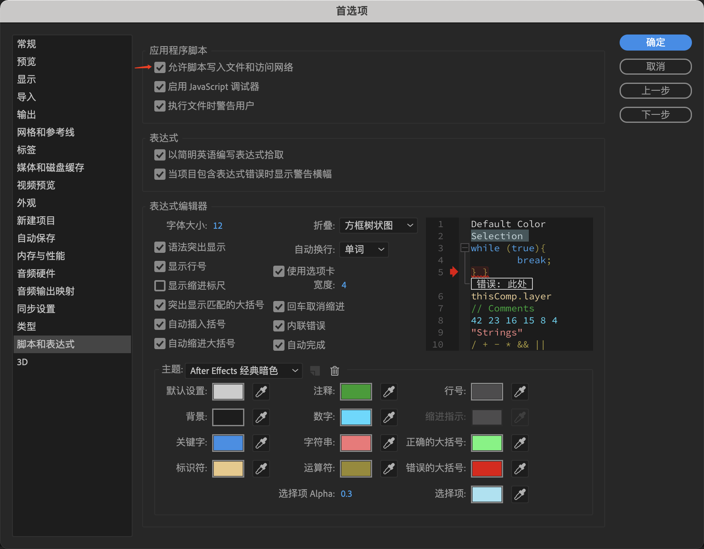

# YYEVA  Design Secification

## Introduction

As mentioned in [YYEVA, Makes the mp4 insert Effects during playing](./YYEVA,Makes_the_mp4_insert_Effects_during_playing.md), `YYEVA` contains a complete tool chain, from the resource output on the design, to resource preview and rendering on the client. This chapter is mainly explain how the plug-in MP4 conversion configures the environment and be used.

## MP4 conversion plug-in main interface


1. `H264/H265` it’s a submodule mainly for expanding `Adobe Effect After`, which can not render out the MP4 directly.
2. `Dynamic` it’s a submodule mainly for Parsing the designer's layers, and export a mixed MP4 resource.
3. `Export log module` is used to export the log of analysis(parse) and conversion, and it is convenient to check some functional bugs of the plug-in.

# Plug-in Env Configuration

### Plug-in Installation

1.	Download [zxp(plug-in install tool)](https://aescripts.com/learn/zxp-installer/) 
2. Download [`YYEVA plug-in`](./AEP/build/2.7.0/YYYSMP4Conveter.zxp), and install it by zxp.
3. Check the plug-in whether installed success.
4. Restart `Adobe Effect After`, and check the path if exists: window->expand->YY-MP4转换。

 

### Env Configuration

1.	Create `YYConvertMP4` template. ***important steps***
	*	Open `Adobe Effect After`, selecte editting---> template ---> output module
	

	* Follow these steps to create `YYConvertMP4` output module.

	

	* Allow Permission in system preferences settings of mac.

	* select Edit > Preferences >_ Scripting & Expressions_ (Windows) or After Effects > Preferences > Scripting & Expressions (Mac OS).

	

	*	Select the Allow Scripts To Write Files And Access Network option.
****
	 

## Plug-in Usage

### Introduction of `H264/H265` module

1.	Select an already made plain transparent MP4 output composition.
2. Open window->expand->YY-MP4Convert plug-in.
3. Converation
	* Set the output path.
	* Select quality option, high(CRF 18), mid(CRF 23), low(CRF 28) and custom quality(users specify the CRF)
	* Click start convert
4. H264 and H265 res will generatre after convertation completed.
	* H264: `[select composition name]_normal_h264_[quality]`
	* H265: `[select composition name]_normal_h265_[quality]`

### Introduction of `Dynamic` module

***This module is mainly parsing `Mask` composition to generate a mixed `MP4` resource with embedded elements.***

#### 1.	Create `Mask` composition

The plugin parses two types of `Mask` compositions

* `mask_text`
* `mask_image`

So, to make a text type of mask, add a composition named `mask_text`, and to make an image type of mask, add a composition named `mask_image`.

 

The above step create two `Mask` composition and pay attention to following secifications:
****
 * Composition name must be `mask_text` or `mask_image`.
 * FrameRate must equal to the composition frameRate.
 * The size of layer must equal to the size of rgb area.

    
   
    

As shown above, the size of the output composition is 1800 x 1000, where the rgb area is 900 x 1000, and the composition created by Mask is also 900 x 1000.

#### 2. Made `Mask` composition

* Make `mask_text`

 

After creating the `mask_text` composition, you can create a "text" layer under the composition. In the example above, we created 2 rectangular layers, which represent the two inserted text elements. With Example of the first layer:

`name` ： anchor_nick-002AFF-36 (The name is separated by char '-', and the formant is key - font-color - font-size)

```js
     `key` ： When client-side rendering, index the name of this `mask`
     `font-color`  : text color
     `font-size` : text size
```

***When the client renders, the above key will be found for dynamic insertion***

 

* Make `mask_image`

 

After creating the `mask_image` composition, you can create a "image" layer under the composition. In the example above, we created 2 oval layers, which represent the two inserted text elements. With Example of the first layer:

`name` ： anchor_avatar-aspectfit (The name is separated by char '-', and the formant is key - scaleMode)

```js
     `key` ： When client-side rendering, index the name of this `mask`
     `scaleMode`  : aspectFill or aspectFill or scaleFill
```

#### 3. Reference 2 `Mask` composites on RGB composites

In rgb composition, it is necessary to refer to the composition of the two masks just made, that is, the two masks are associated.

 

#### 4. Export resource

 

After waiting for the conversion to complete, you will get 2 mixed MP4 resources in the specified output path.

* H264: `[select composition name]_dynamic_h264_[quality]`
* H265: `[select composition name]_dynamic_h265_[quality]`

Designers can preview the composite video in the preview interface.

[Preview interface](https://gfe.yy.com/e-video/preview/)

In the preview interface, drag the output file into the preview area to see the key and type of the embeddable elements contained in the current video.

You can use the mixed MP4 resource file provided at the end of the article to try it out~

[Test file](./img/输出_dynamic_264_mid.mp4)
