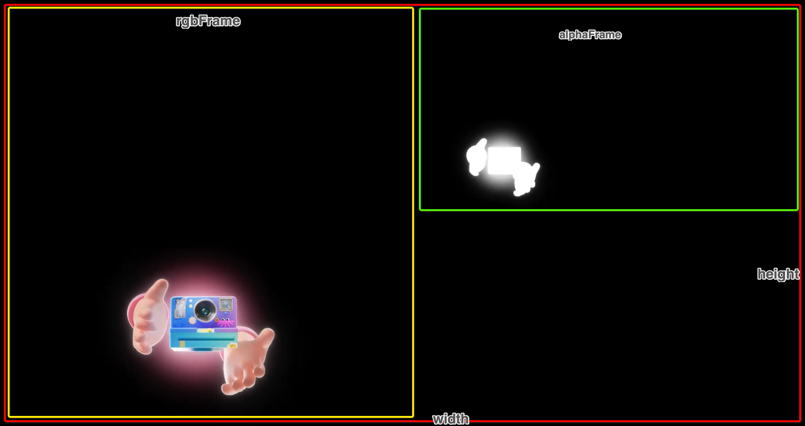

# YYEVA-docs

## Introduction

* The Json data loaded by YYEVA is compressed by zlib and then converted to base64.
* The converted data is written in the Metadata section of MP4.

## Format specification

```js
{
	"descript": {                          //Description of the video
		"width": 1808,                     //width of the video
		"height": 1008,                    //height of the video
			"isEffect": 1,                     //Whether it is a dynamic element video
		"version": 1,                      //version of plug-in
		"rgbFrame": [0, 0, 900, 1000],     //Position info of rgb
		"alphaFrame": [900, 0, 450, 500]   //Position info of alpha area
	},
	"effect": [
         {  //Mask description information for dynamic elements ： text type
		"effectWidth": 700,        //width of the dynamic element
		"effectHeight": 1049,      //height of the dynamic element
		"effectId": 1,             //index id of the dynamic element
		"effectTag": "nickName",   //tag of the dynamic element of the key for logic code using.
		"effectType": "txt",       //dynamic element type, txt and img
        "fontColor":"#ffffff",     //It only exists when it is of txt type. If it is not specified on the design side, the default value is specified by the rendering side
        "fontSize":13,             //It only exists when it is of txt type. If it is not specified on the design side, the default value is specified by the rendering side
	},{  //Mask description information for dynamic elements    ： image type
        "effectWidth": 300,  //same as above
        "effectHeight": 400,//same as above
        "effectId": 2,       //same as above
        "effectTag": "user_avatar",   //same as above
        "effectType": "img",  //same as above
        "scaleMode":"aspectFill",  //It only exists when it is of img type. If it is not specified on the design side, the default value is specified by the rendering side
    }...],
	"datas": [{                                      //potion infomation of dynamic element each frame
		"frameIndex": 0,                             //index of frame
		"data": [{       
			"renderFrame": [x1, y1, w1, h1],         //postion of canvas
			"effectId": 1,                           //id of dynamic element
			"outputFrame": [x1`, y1`, w1`, h1`]      //position of video
		}，{       
            "renderFrame": [x2, y2, w2, h2],         //same as above
            "effectId": 2,                           //same as above
            "outputFrame": [x2`, y2`, w2`, h2`]      //same as above
         } ... ]
}
```

## Field overview

The json contains 3 layers: descript/effect/datas

1. descript: general information describing the resource
2. effect: describe all mask related information under this resource
3. datas:	description The position information of the mask for each frame

## Detail

### `descript`

***General information describing the resource***



1. width,height: width or height of the video
2. isEffect: Whether it is a dynamic element video
3. version": version of plug-in
4. rgbFrame": Position info of rgb
5. alphaFrame": position info of alpha area

### `effect`

***Describe all mask related information under this resource. For each mask, an element will be saved in this field to describe the type-related information of the mask.***

At present, masks are divided into two types: image text, which can be judged according to effectType.

1. Basic Property

	* effectWidth: width of the dynamic element
	* effectHeight: height of the dynamic element
	* effectId: index id of the dynamic element
	* effectTag: tag of the dynamic element of the key for logic code using.
	* effectType: dynamic element type, txt and img

2.	Unique properties

	* text type (effectType == txt)

		fontColor: 
when it is text, it indicates the text color that needs to be specified when rendering on the client side.
		fontSize: 
when it is text, it means the text size that needs to be specified when rendering on the client side.

	* image type (ffectType ==  img)
		saleMode: the stretching method when the image is adapted to the display area of ​​the client. There are three types of values.

		1.	scaleFill:
Don't keep image aspect ratio, surfacing background area, default mode
		2.	aspectFit: Maintain the aspect ratio of the image and scale the image to the smallest size that will completely cover the background positioning area
		3. 	aspectFill: Maintains the aspect ratio of the image and scales the image to the largest size that will fit in the background positioning area

### `datas`


***The position information of the mask for each frame***

For each mask element of each frame, there will be a data segment to describe how the mask element should be displayed in this frame.

* frameIndex: index of frame
* data: all mask information of current frame
* effectId: Indicates which mask the data belongs to, and corresponds to the effectId under the effect. The corresponding mask information can be indexed under the effect.
* outputFrame: Indicates the position information of the mask in the output video area.
* renderFrame: Indicates the position of the mask on the rendering canvas.