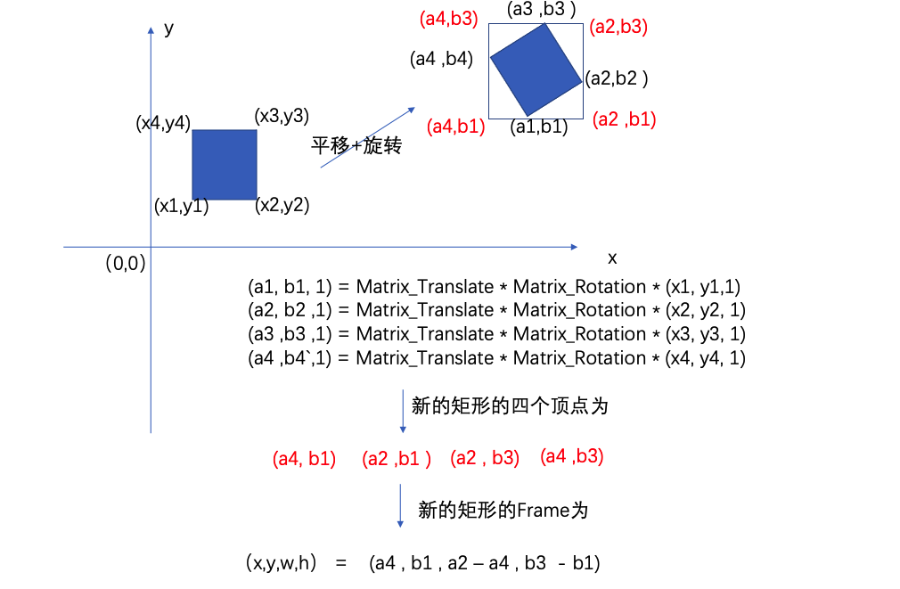
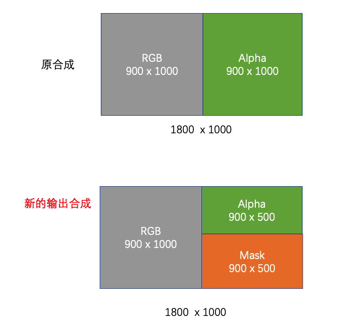
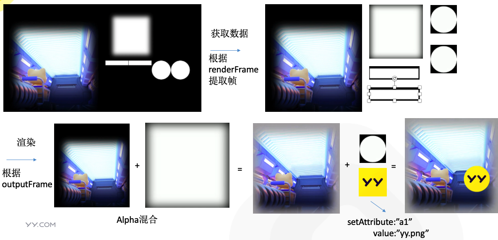
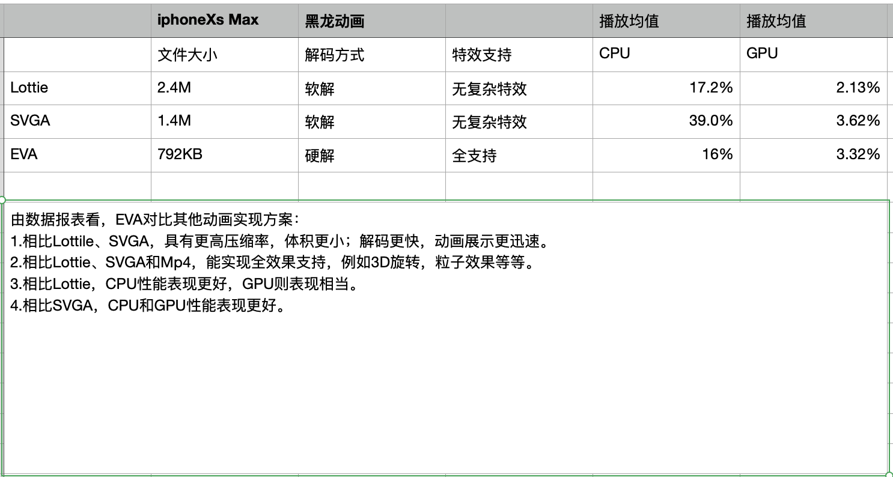

# YYEVA , 让MP4静态资源也能够动态起来

## 介绍

在很多业务场景中，需要在静态资源 叠加 业务数据，例如，在直播间的送礼场景下，需要在动效资源内添加用户和主播的头像和昵称。目前比较成熟的方案有 `SVGA`，`Lottie`，这两种方案都能实现在资源显示的时候，动态添加业务数据，但这2种技术方案都不适合一些复杂的3D动效。在直播领域，一些大额的礼物动效都使用了`MP4`资源来播放。

因此，去年下半年，YY也着手研究如何让MP4能够像前两者一样，支持动态元素插入，满足视觉效果的前提下，更好的和业务结合，在研究2个月后，我们完成了`YYEVA (YY Effect Video Animate)`的开发，并推出了整套工具链，覆盖 设计侧的资源输出、在线预览 、客户端测的渲染。
`YYEVA`包含的工具链： `Adobe After Effect`插件、 `Preview`预览页面、各平台渲染SDK

在这边文章发布前，我们也上线了几个新的礼物动效，如漫画脸礼物，使用了该方案完成MP4静态资源动态化。

设计师篇，请跳转到文档: [第五篇:YYEVA设计规范](./YYEVA设计规范.md)


## 探索

在 [第二篇:透明MP4礼物](./docs/透明MP4礼物.md) 文章里，有介绍过，`MP4`资源，使用`YUV`颜色采样标准，本身是不支持`alpha`通道的，透明`MP4`实现方案就是增加了一个区域来存放源素材的`alpha`通道。因此，我们也是按照该思想，再进一步去扩充`MP4`的能力。
经过和设计师的沟通，我们确定了动态插入的元素 暂分为 “文字“ ”图片” 两种类型

同时，资源是由动画同学去设计导出的，理应由他们来指定应该
  * 插入什么类型的元素 ?
  * 以什么样的形状 ？
  * 插入在画布的什么位置 ？ 
  
 这里就存在三个关键信息： 
   * 元素类型
   * 元素的形状 
   * 元素的位置 
 
我们要做的，应该是制作一个`Adobe Effect After`插件，通过解析设计师制作的资源，把这些相关信息都保存下来，然后客户端就能够拿到这些数据后，去复原整个动画过程。

在 [第三篇:变换矩阵在动画上一些应用](./docs/变换矩阵在动画上一些应用.md) 文章里，有介绍过，动画实质上就是通过将像素点左乘一个仿射矩阵，得到了一个新的位置。那我们如果能够通过 `Adobe After Effect` 提供的接口，去获取到每一帧图层的相关变换，然后构造一个相关的仿射矩阵，我们就能够获取到图层每一帧的位置。
事实上，我们就是按照这个思想，去完成整个`YYEVA`的方案。


## `YYEVA` 具体实现方案

### `Adobe Effect After`插件测 

***该功能模块主要是给设计师提供制作MP4开发的相关插件***

我们开发的插件的主界面如下： 


其中
* `h264`/`h265` : 主要是为了扩充`Adobe Effect After` 无法直接渲染出 `MP4` 而开发的一个子模块
* `Dynamic` : 主要是用来解析设计师的图层，导出一个混合`MP4`资源的子模块
* `导出日志模块`：主要是快速导出解析和转换过程中的日志，方便排查插件的一些功能 `BUG`

下面对插件完成的功能每一个步骤进行详细的论述

#### 1. 动效设计师 制作混合MP4素材

使用AE制作混合MP4的时候，需要遵循  [第五篇:YYEVA设计规范](./docs/YYEVA设计规范.md) ，才能够正确解析出混合MP4资源。具体相关规范，请跳转至链接查看。

#### 2. 转换前的准备工作

插件在进行转换前，会检测所选图层的合法性。主要是检测：
*  所选合成是否包含透明区域图层，因为我们目前开发的插件是在透明`MP4`礼物的基础上做的一个扩充，所以源素材必须是一个透明`MP4`资源。
*  所选合成是否包含`Mask`遮罩区域；`YYEVA`插件设计规范有介绍，
   * 文字遮罩区域是以 `mask_text` 作为合成的`name` 
   * 图片遮罩区域是以mask_image作为合成的name
   
   如果都不包含两者，插件认为无需进行混合MP4的转换。
*  检查AE是否包含 `YYConverterMP4` 模板，如果不包含，请参考 `YYEVA` 插件设计规范 进行模板配置，该步骤是为了扩充AE转换MP4的能力，进行一些渲染队列的相关配置。

#### 3. 分析、处理设计师的图层相关数据

通过合法性验证后，插件开始解析设计师指定的合成。
*  遍历项目的合成，提取出 mask_text 和  mask_image 这2个遮罩合成，并分为 图片和文字 两大类型
*  分别遍历图片和文字2大类型中的所有有效图层，获取每个图层在每一帧的仿射矩阵：matrix
*  根据步骤2获取的仿射矩阵matrix，可以得到每一个图层在画布上每一帧的位置 renderFrame

```js
具体计算方法如下：（以一个图片图层为例）

1. 获取图片图层AVLayer的内容大小 : layer.width 、 layer.height

2. 用上面计算的宽高，构造4个顶点： 
    leftTop:[0,0,1]  
    leftBottom:[0,height,1] 
    rightTop:[width,0,1] 
    rightBottom:[width,height,1]

3. 遍历AVLayer每一帧的matrix，乘以上面构造的4个顶点 (x1,y1)、(x2,y2)、(x3,y3)、（x4,y4） 
可以得到一组变换后的4个新顶点(a1,b1)、(a2,b2)、(a3,b3)、(a4,b4)，这4个新的顶点 即为layer在该帧下变换后的顶点

4  计算新的四个顶点构成的最大矩阵区域，生成新的四个顶点 (a4,b1) 、 (a2,b1) 、 (a2,b3) 、(a4,b3)

5  根据3.4的四个顶点，算出一个新的`frame`，保存为该`layer`在该帧`frame` ： [a4 , b1 , a2 – a4 , b3  - b1]

```

***对于 步骤4 的计算方法，如下图案例：*** 



***以上步骤即可以得到第一个关键数据 renderFrame ,即 mask 每一帧在屏幕上的位置数据***

* 拷贝选中的合成，用于添加到渲染队列时使用的输出合成，防止在原合成上操作，影响到 原始 合成资源
* 针对拷贝后的输出合成，缩小 alpha 区域0.5倍，划分为三个区域：区域1、区域2、区域3
```js
例如 1800 * 1000的 视频

 -   源合成
     -   区域1. 左边 900 * 1000 存 rgb
     -   区域2. 右边 900 * 1000 存 alpha

 -   输出合成
     -   区域1. 左边 900 * 1000 存 rgb
     -   区域2. 右边 900 * 500 存 alpha
     -   区域3. 右边 900 * 500 存 mask
```



* 拷贝所有的有效遮罩合成到步骤4的输出合成的区域3
* 该步骤会将图片和文字遮罩下的所有图层，拷贝到输出合成的区域3中，并且需要动态调整 所有图层的大小 和 位置，并将大小和位置 存储在 `outputFrame` ，用于之后能够通过 `outputFrame` 获取到这些遮罩的形状 
  * 保存区域3的可容纳的宽高，用于判断是否足够容纳copy过来的图层
  * 获取计算出的当前需拷贝图层的 renderFrame
  * 计算从当前mask图层的位置 变换到 新的 beginX 和 beginY 位置的仿射矩阵
  * 将mask图层的位置，应用 上步骤计算 的仿射矩阵
  * 计算出拷贝后的mask图层的位置 mask_Frame ，并记录下来
  * 更新 beginX 和 beginY 和 maxWidth 及 maxHeight

***针对每一个`Mask`图层应用了上面的操作后，我们可以得到又一个关键的数据`outputFrame`,即`Mask`每一帧在输出上的位置数据***


#### 4、生成混合`MP4` 资源

通过步骤三相关的图层分析，我们可以得到如下内容数据
* `Mask` 在屏幕上的每一帧的位置 `renderFrame`
* `Mask` copy到拷贝合成中，每一帧的位置 `outputFrame`
* 将 `renderFrame` 和 `outputFrame` 添加到一个 `Json` 数据结构里
* 使用 创建的模板 `YYConverterMP4` ,将拷贝合成 添加到渲染队列中
* 使用 `h264/h265` 的扩展功能， 将渲染生成的 `AVI` 资源 转成 `MP4` 资源
* 将 步骤3 的数据 用 `zlib` 打包后，使用 `base64` 的方式存储
* 将生成的 `base64` 数据，封装成如下格式
* 由于 H5 不会嵌入 `ffmpeg` 库，因此 H5 提取 `Metadata` 段的方式依赖用正则匹配，因此我们的 `Metadata` 数据格式会加上前后缀 `yyeffectmp4json[[base64]]yyeffectmp4json` ,这样可以方便 `H5` 快速定位到 `Metadata` 段的数据

```js
 var templateStart = "yyeffectmp4json[["
 var templateEnd = "]]yyeffectmp4json"
 base64 =  templateStart + base64 + templateEnd
```
 
### 客户端测

  客户端拿到了 `混合MP4` 资源后，需要将写入的 `base64` 提取出来，并解压缩数据，并结合解码后的每一帧数据，完成最终的渲染工作。
  
  #### 1. 提取 `Json` 数据
  
  使用 ffmpeg SDK 或者 正则表达式 ，从 MP4 中提取出 `Metadata` 存储的 `base64` 数据,去前缀后后并通过 `zlib` 解包后，得到真正存储的 `Json` 数据
  
  
  #### 2. 获取解码后的渲染帧
  
  对 `MP4` 的 `Video Track` 使用硬解后，得到解码后每一帧的 `pixelBuffer`
  
  #### 3. 根据Json数据和渲染帧数据，并结合传入的业务数据，完成上屏操作
  
  
  
## 性能数据 

  
 
## Json 数据结构定义

  [Json数据结构定义](./数据结构.md) 
  

  
