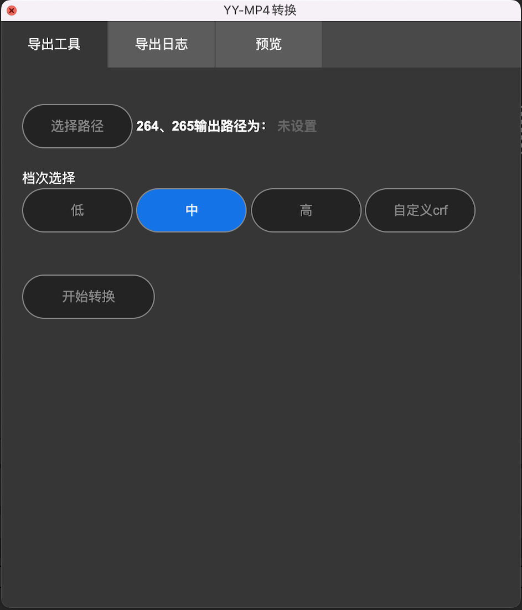
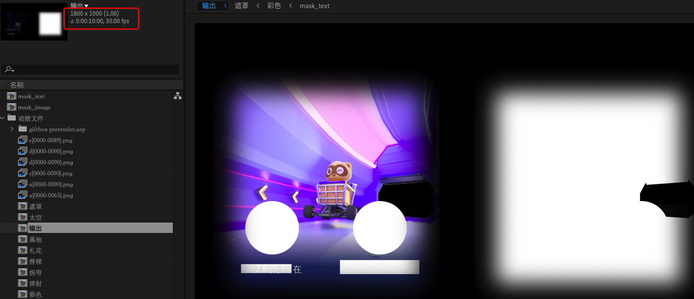
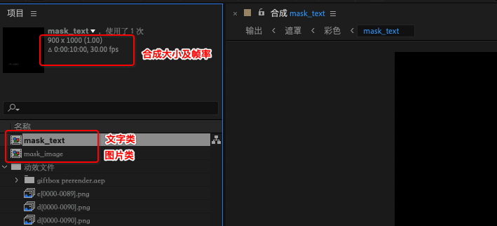
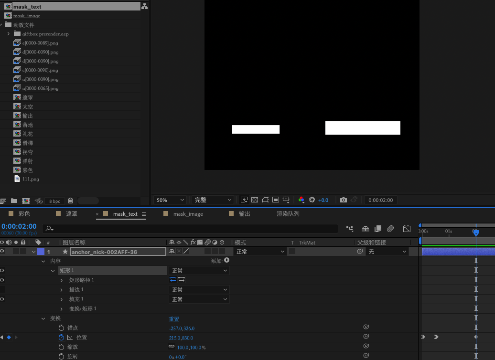
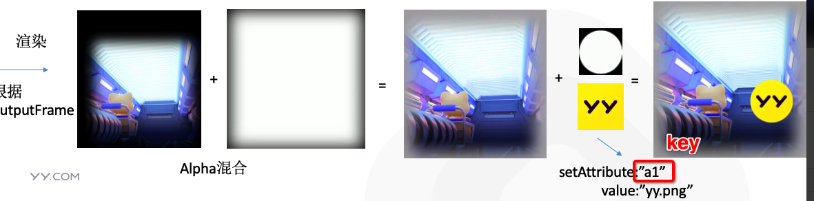
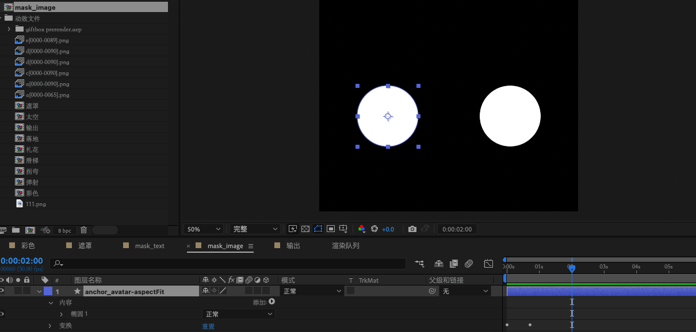
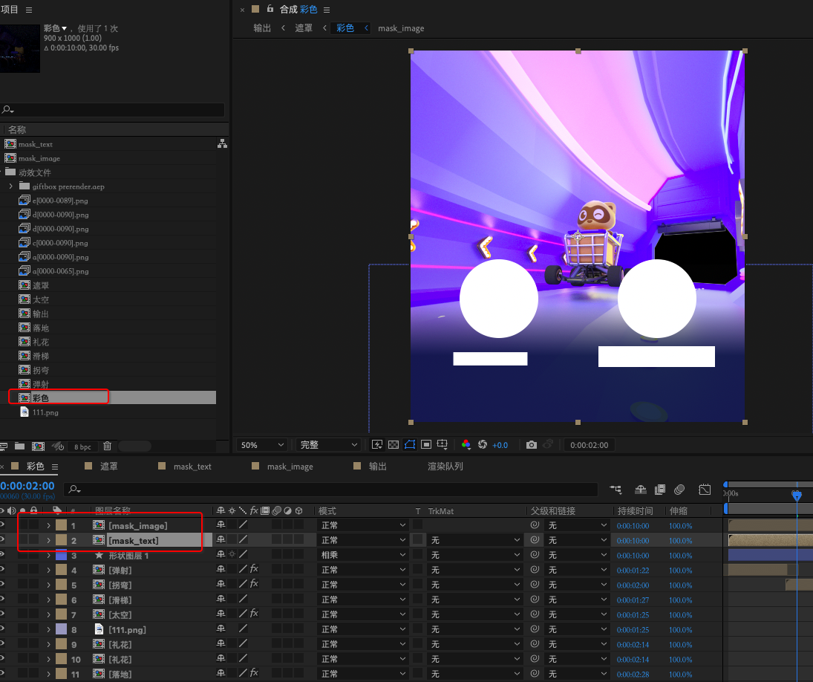
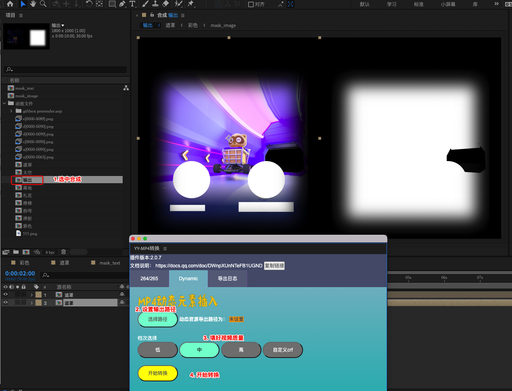

# YYEVA设计规范
 
 
## 介绍

  在 [第四篇:YYEVA , 让MP4静态资源也能够动态起来](./YYEVA-让MP4静态资源也能够动态起来.md) 文章中有提到， `YYEVA` 包含一套完整的工具链，从设计端的资源输出，到资源预览，再到客户端的渲染 `SDK` 。本章内容主要是讲解 `YYEVA` 设计端的插件 `YY-MP4` 转换  是如何配置环境 和使用的。

## YY-MP4转换 插件主界面 

  
  

其中

1. `h264/h265` : 主要是为了扩充 `Adobe Effect After` 无法直接渲染出 MP4 而开发的一个子模块
2. `Dynamic` : 主要是用来解析设计师的图层，导出一个混合MP4资源的子模块
3. `导出日志模块`: 主要是快速导出解析和转换过程中的日志，方便排查插件的一些功能 BUG


## 插件安装和环境搭建

 [文档](https://github.com/yylive/YYEVA/blob/main/%E5%B7%A5%E5%85%B7%E5%AE%89%E8%A3%85%E5%92%8C%E7%8E%AF%E5%A2%83%E6%90%AD%E5%BB%BA.md)


## 插件使用
      
 ### `h264/h265`模块  使用介绍 
  1. 选中一个已经制作好的  普通透明MP4  输出合成
  2. 打开 窗口 ->  扩展 ->  YY-MP4转换 工具
  3. 开始转换  
      1. 设置输出路径
      2. 选择 视频质量 的档位   其中： 高档（ CRF 18） 中档：( CRF  23)  低档：（ CRF 28） ， 自定义可以自行决定 CRF 的值 
      3. 点击开始转换 
  4. 资源输出  (会在指定的输出路径 ： 资源输出 一套   MP4 资源，输出的文件名规范为 )
        * h264 资源:  选择的合成name_normal_h264_档位.mp4
        * h265 资源:  选择的合成name_normal_h265_档位.mp4
     
 
 ### `Dynamic`模块 使用介绍
 
   ***该模块主要是通过解析 `Mask` 合成，生成一个 带嵌入元素的混合 `MP4` 资源***
  
   #### 1. 创建`Mask` 合成

   插件会解析读取两种类型的 `Mask` 合成   
   
  * `mask_text`    
  * `mask_image` 
     
   因此，如需制作文字类的遮罩，请添加一个 `mask_text` 命名的合成，如需制作图片类的遮罩，请添加一个  `mask_image` 命名的合成。
    
   
   
   上图 创建了 2个 `Mask` 合成，这里需要注意 创建的规范是：
   
   *  合成的命名必须是  mask_text 或者  mask_image 
   *  图层的大小 和 帧率 必须与输出合成的  帧率及rgb区域的大小 保持一致



    


    
   
   如上图，输出合成的大小是 1800 x 1000 ，其中  rgb 区域 是 900 x 1000，则  Mask 创建的合成也要是 900 x 1000。
   
   此处的900x1000只是该案例Demo的分辨率大小，实际使用时 ，不需要按这个分辨率来设计，可以随意使用适合自己项目的分辨率

   #### 2. 制作 `Mask` 合成
   
   * 制作 `mask_text`
   
   
   
   
   创建完`mask_text`合成后 ,就可以在该合成下面去制作"文字类"图层了，上图的案例中，我们创建了2个 矩形图层，分别代表的是插入的2个文字元素   以第一个图层为例
   

`name` ： anchor_nick-002AFF-36
      名称以   -  符号作为分隔  ,支持的格式 为   key   -    font-Color   -  font-size 

```js
   `key` ： 客户端渲染时 ， 索引该  `mask`  的名称
   ` font-color`  : 该文案的颜色
   `font-size` : 该文案的大小
```
   
   ***当客户端渲染时，会找到上面的key，来进行动态插入*** 
   
     
   * 制作 `mask_image` 
   
    创建完`mask_image`合成后 ,就可以在该合成下面去制作"图片类"图层了,上图的案例中，我们创建了2个 椭圆 图层，分别代表的是插入的2个图片类的元素  以第一个图层为例
<br />   
<br />   
 name: anchor_avatar-aspectfit
        
        说明: 名称以 - 符号作为分隔  ,支持的格式 为key-scaleMode 
         
         字段解释:  
          
          key:客户端渲染时 ， 索引该  mask  的名称
          
          scaleMode:图片放缩时的模式
            * aspectFill 保持图像的纵横比并将图像缩放成将适合背景定位区域的最大大小。
            * aspectFit 保持图像的纵横比并将图像缩放成将完全覆盖背景定位区域的最小大小。
            * scaleFill 不保持图像的纵横比，铺面背景区域。 
     
  #### 3. 在RGB的合成上引用2个`Mask`合成
  
  在  rgb 合成上，需要引用刚刚制作好的两个  Mask 合成，即关联上了这2个  Mask 
        
  
  
  #### 4. 使用插件 导出资源
  
  

  等待转换完成后，会在指定的输出路径，得到2个 混合 MP4 资源

   *  h264 ： 输出合成的name_dynamic_264_mid.mp4
   *  h265 ： 输出合成的name_dynamic_265_mid.mp4
  

  设计同学可以在预览界面，预览该合成视频
  
   [预览工具](https://gfe.yy.com/e-video/preview/) 
   
   
   在该预览界面下，将输出文件拖入预览区域，即可看到当前视频包含的可嵌入的元素 的 key 及类型
   可以使用文章末尾的提供的混合 MP4 资源文件，试试看效果哦~
   
   [测试资源文件](./img/输出_dynamic_264_mid.mp4)
