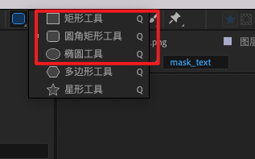
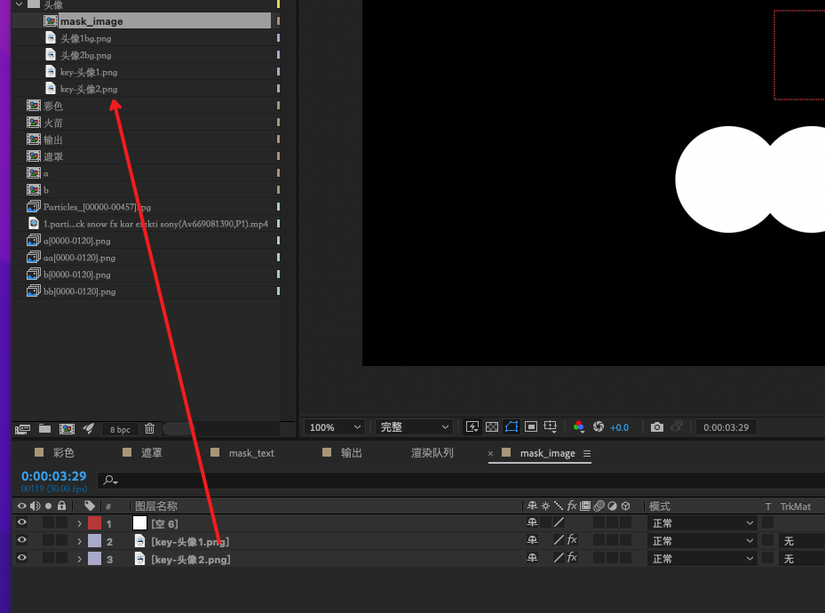

# YYEVA设计规范
 
 
## 介绍

  在 [第四篇:YYEVA , 让MP4静态资源也能够动态起来](./YYEVA-让MP4静态资源也能够动态起来.md) 文章中有提到， `YYEVA` 包含一套完整的工具链，从设计端的资源输出，到资源预览，再到客户端的渲染 `SDK` 。本章内容主要是讲解 `YYEVA` 设计端的插件 `YY-MP4` 转换  是如何配置环境 和使用的。

## YY-MP4转换 插件主界面 

  
  
1. **导出工具**

    1. 扩展`Adobe Effect After` 直接渲染出 MP4 能力
    2. 解析设计师制作的Mask合成，生成描述信息
    3. 将描述信息和MP4渲染成一个YYEVA资源

2. **导出日志模块**

    快速导出转换过程中的日志，方便排查插件的一些功能 BUG
    
3. **预览**

    方便设计师实时查看各端渲染效果，做出调整

## 插件安装和环境搭建

 [文档](https://github.com/yylive/YYEVA/blob/main/%E5%B7%A5%E5%85%B7%E5%AE%89%E8%A3%85%E5%92%8C%E7%8E%AF%E5%A2%83%E6%90%AD%E5%BB%BA.md)
 
 [视频1:YYEVA-AE相关工具安装](https://haokan.baidu.com/v?vid=3491294283278333966)
 
 [视频2:YYEVA-AE环境搭建](https://haokan.baidu.com/v?vid=3992716940524068736)
 
 [视频3:YYEVA-如何创建一个mask合成](https://haokan.baidu.com/v?vid=4642247610775827417)
 
 [视频4:YYEVA-制作mask_text](https://haokan.baidu.com/v?vid=4194131635125381977)

 [视频5:YYEVA-制作mask_image](https://haokan.baidu.com/v?vid=3618349934251838627)
 
 [视频6:YYEVA-如何安装或更新CEP插件](https://www.bilibili.com/video/BV1ia411R7Dn/)
 


## **导出工具** 使用介绍 
 
   导出工具支持两种模式的资源转换 
   * 普通资源转换
   * 动态元素MP4转换
   内部会根据选择的合成是否有引用`mask_`合成来判断选择哪种转换模式输出资源

### 普通资源转换

   如果输出的合成没有引用任何的 `mask_*` 合成，即插件在转换时，获取不到 `当前合成` 和 `mask_*` 合成有任何的引用链关系,内部即会选择该模式，将选择的合成渲染成一个MP4资源。步骤如下

  1. 选中一个已经制作好的输出合成
  2. 打开 窗口 ->  扩展 ->  YY-MP4转换 工具
  3. 开始转换  
      1. 设置输出路径
      2. 选择 视频质量 的档位   
            * 高档：   CRF=18  
            * 中档：   CRF=23   
            * 低档：   CRF=28 
            * 自定义： 自行决定 CRF 的值 
      3. 点击开始转换 
  4. 资源输出  (会在指定的输出路径 ： 资源输出 一套   MP4 资源，输出的文件名规范为 )
        * h264 资源:  选择的合成name_normal_h264_档位.mp4
        * h265 资源:  选择的合成name_normal_h265_档位.mp4
     
 
### 动态元素MP4转换 
 
   该模块主要是通过解析 `mask_*` 合成，生成一个 带嵌入元素的混合 `MP4` 资源。
   
   **注：之前有提到过，动态元素MP4是在透明MP4的基础上，开发的一个功能，所以我们选择的输出合成，必须是一个左边RGB，右边Alpha的画布。如果不是，内部会帮用户使用白色(#ffffff)创建一个蒙版效果，来自动生成一个这样的合成，所以当您的合成可以使用效果白色(#ffffff)创建一个蒙版生成alpha区域的时候，可以不需要去制作这样一个左边RGB，右边Alpha的合成，直接选择您的rgb合成就可以使用我们插件输出，内部会帮您去完整接下来的事情**
  
   #### 创建`mask_*`合成

   插件会解析读取`mask_*` 合成，包含两种类型：
   
  * `mask_text`    
  * `mask_image` 
     
   因此，如需制作文字类的遮罩，请添加一个 `mask_text` 命名的合成，如需制作图片类的遮罩，请添加一个  `mask_image` 命名的合成。
    
   
   
   上图 创建了 2个 `mask_*` 合成，这里需要注意 创建的规范是：
   
   *  合成的命名必须是  `mask_text` 或者  `mask_image`
   *  图层的大小 和 帧率 必须与输出合成的  帧率及rgb区域的大小 保持一致


    


    
   
**注**
1. 此案例输出合成的大小是1800x1000,其中rgb区域是900x1000，alpha区域是900x1000,因此创建的`mask_*` 合成也要是900x1000   
2. 此处的900x1000只是该案例Demo的分辨率大小，实际使用时，不需要按这个分辨率来设计，可以随意使用适合自己项目的分辨率
   


   #### 制作 `mask_*` 合成
   
   #####  制作 `mask_text`
   
   
   
   
   创建完`mask_text`合成后 ,就可以在该合成下面去制作"文字类"图层了，上图的案例中，我们创建了2个 矩形图层，分别代表的是插入的2个文字元素   以第一个图层为例
   

`name` ： anchor_nick-002AFF-36
      名称以`-`符号作为分隔, 格式为   key-fontColor-fontsize 

```js
   key:       客户端渲染时，索引该mask的名称
   fontColor: 该文案的颜色
   fontSize:  该文案的大小
```
   
   ***当客户端渲染时，会找到上面的key，来进行动态插入*** 
   
     
   #####   制作 `mask_image` 
   
   
   
创建完 `mask_image` 合成后 ,就可以在该合成下面去制作"图片类"图层了,上图的案例中，我们创建了2个 椭圆 图层，分别代表的是插入的2个图片类的元素  以第一个图层为例

 name: anchor_avatar-aspectfit  以 `-` 符号作为分隔  ,支持的格式为 key-scaleMode 
         
```js
   key:         客户端渲染时，索引该mask的名称
   scaleMode:   图片放缩时的模式
     aspectFill 保持图像的纵横比并将图像缩放成将适合背景定位区域的最大大小。
     aspectFit 保持图像的纵横比并将图像缩放成将完全覆盖背景定位区域的最小大小。
     scaleFill 不保持图像的纵横比，铺面背景区域。 
``` 
            
#####   目前插件已支持的图层

  插件内部解析的Mask图层，支持 形状图层 和 引用其他图片图层  
  
  1. 支持形状图层
    
   不管是文字，还是图片，我们都只记录形状和位置，所以我们目前支持的形状图层，包含了矩形类、圆形类、椭圆类 三种。
   
   
 
  2. 支持引用其他图片图层  
    
   如一些复杂的形状，我们支持在mask内部引用其他图片图层来支持
     
   
    
  3. 除其他上面2类的图层，其他图层（如文本类）暂不支持

     
  ####   在RGB的合成上引用2个`mask_*`合成
  
  在  rgb 合成上，需要引用刚刚制作好的两个  Mask 合成，即关联上了这2个  Mask 
        
  
  
  ####  使用插件 导出资源
    
  等待转换完成后，会在指定的输出路径，得到2个 混合 MP4 资源

   *  h264 ： 输出合成的name_dynamic_264_mid.mp4
   *  h265 ： 输出合成的name_dynamic_265_mid.mp4
  

  设计同学可以在预览界面，预览该合成视频
  
   [预览工具](https://yyeva.netlify.app/) 
   
   
   在该预览界面下，将输出文件拖入预览区域，即可看到当前视频包含的可嵌入的元素 的 key 及类型
   可以使用文章末尾的提供的混合 MP4 资源文件，试试看效果哦~
   
   [测试资源文件](./img/输出_dynamic_264_mid.mp4)
