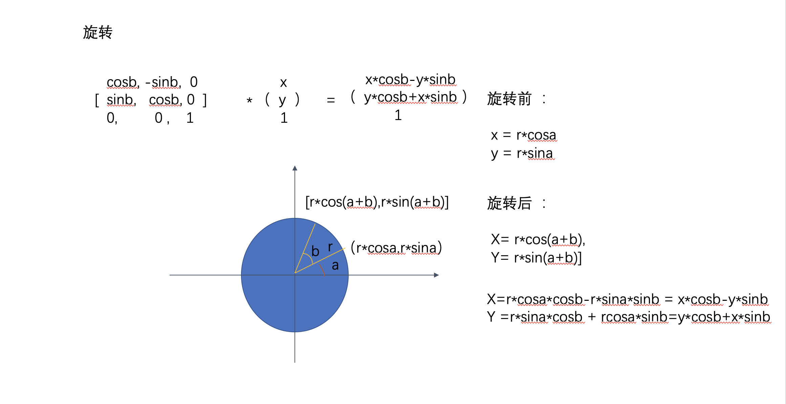

# 变换矩阵在动画上一些应用

## 介绍

我们都知道，屏幕是由像素点组成的。而动画的实质，就是对元素内的像素点进行平移，旋转，放缩等相关操作。如何把相关操作，用数学的形式表示出来，并通过计算机的方式来还原，这时候就需要通过变换矩阵来描述了。本章我们来通过一些数学公式，理解下如何通过变换矩阵，把动画的过程描述下来。下面我们以二维平面为例，展开论述。

## 1. 齐次坐标

在齐次坐标领域，有一个确切的结论 ，二维平面内

```js
    点：   用 (x, y, 1)来表示坐标系中一个固定的坐标点
    向量： 用 (x, y, 0) 来表示坐标系中一个有向线段 
```

可以得出第三个分分量 区别就是0与1。点的重点在点，向量的重点在方向。


## 2.矩阵相乘

2个矩阵相乘的前提条件是：前一个矩阵的列 要等于后一个矩阵的行，且得到的结果是 前一个矩阵的行x后一个矩阵的列，即

```js
n x m * m x k = n x k
```

## 3.矩阵运算

### 3.1 平移

考虑一个点（x,y,1）,我们知道，一个点在x轴上平移3个单位，y轴上平移4个单位，平移后的结果为 （x+3,y+4,1）。我们使用列向量 来表示点 ，通过上面的矩阵相乘我们知道，需要构造一个 3x3的矩阵，且左乘 列向量后，才能够得到 一个新的 3x1 的列向量
即推到公式如下：

```js
  a b c              x                 x+3
( d e f )   *      ( y  )     =      ( y+4 )
  g h i              1                  1
  
所以：

 ax + by + c  = x + 3
 
 dx + ey + f  = y + 4
 
 gx + hy + i  = 1  
 
得到： 

a = 1   b = 0  c = 3 

d = 0   e = 1  f = 4

g = 0   h = 0  i = 1


所以得到的矩阵为    

   1  0  3                       1  0  dx
(  0  1  4 )  ===平移矩阵===>  (  0  1  dy )
   0  0  1                       0  0  1
  
```

可以看到， 让一个像素点 平移dx ,dy 。 即 构造一个上方的矩阵后，左乘 向量 即可得到新的点


### 3.2 缩放

考虑一个点（x,y,1）,我们知道，一个点在x轴上伸缩3倍，y轴上伸缩4倍，伸缩后的结果为 （3x,4y,1）同理，需要构造一个 3x3的矩阵，且左乘 列向量后，得到新的结果
即推到公式如下：

```js
  a b c              x                  3x 
( d e f )   *      ( y  )     =      (  4y )
  g h i              1                  1
  
所以：

 ax + by + c  = 3x
 
 dx + ey + f  = 4y
 
 gx + hy + i  = 1  
 
得到： 

a = 3   b = 0  c = 1

d = 0   e = 4  f = 0

g = 0   h = 0  i = 1


所以得到的矩阵为    

   3  0  0                       a  0  0
(  0  4  0 )  ===伸缩矩阵===>  (  0  b  0 )
   0  0  1                       0  0  1
  
  
```

### 3.3 旋转

考虑一个点（x,y,1）,我们知道，绕着圆点旋转 b 度。这里用一个图来展示下 旋转后的结果




```js

旋转前 ： 

 x1 = r*cosa
 y1 = r*sina

旋转后：

 x2 = r*cos(a+b) = r*cosa*cosb - r*sina*sinb = x1*cosb - y1*sinb
 y2 = r*sin(a+b) = r*sina*cosb + rcosa*sinb  = y1*cosb + x1*sinb
 
  a b c              x1                  x2 
( d e f )   *      ( y1  )     =      (  y2 )
  g h i              1                    1
  
 a * x1 + b * y1 + c = x2
 d * x1 + e * y1 + f = y2
 g * x1 + h * y1 + i = 1
  
 得到 
 
 a=cosb  b=-sinb c=0
 
 d=sinb  e=cosb  f=0
 
 g=0     h=0     i= 1

所以得到的旋转矩阵为： （其中b为旋转的角度）
 
   cosb -sinb 0
 ( sinb cosb 0 )     
   0     0   1
```

## 4. 仿射变换

仿射变换就是用数学表达式，通过以上矩阵变换进行组合，可以用来左乘点列向量，表示像素点的变换
其中注意：左乘一般是先放缩、旋转变换，再做平移变换，例如

```js
    对像素点 (3,4,1) -》 x轴正方向平移一个单位，y轴正方向平移2个单位后 -》 x轴方向放大2倍，轴方向放大2倍
    
   1.先平移，再变换
   
     2,0,0      1,0,2      3          10
   ( 0,2,0 ) * (0,1,2) * ( 4 )  =   ( 12 )  
     0,0,1      0,0,1      1          1
     
     可以看出，得到的结果 平移的值也被放大了2倍
     
   2.先放缩，再平移
   
     1,0,2      2,0,0      3          8
   ( 0,1,2 ) * (0,2,0) * ( 4 )  =   ( 10 )  
     0,0,1      0,0,1      1          1
     
     可以看出，得到的结果 平移的值按预期得到
```

总结变换矩阵如下表示

```js
              a 0 dx
旋转矩阵 =   ( 0 b dy )
              0 0 1
```

其中 a b 共同影响着旋转和缩放 ,dx ,dy影响位移

