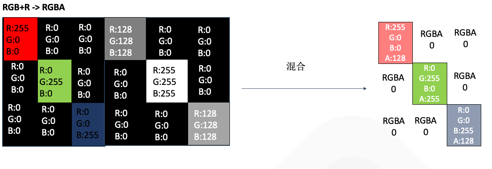

# YY透明MP4礼物

本章是对目前直播行业比较成熟的播放透明MP4礼物实现方案的一些理解，内容全部来自个人对整个工具链的认识，如果有理解不到位的地方，希望可以在评论区和我一起探讨。


## 1.MP4的简单理解

MP4是一种流媒体的封装格式，内部常使用 avc作为视频轨道的编码方式，aac作为音频轨道的编码方式，在编码avc的时候，使用的颜色采样标准是YUV，YUV是一种色度+亮度的颜色采样格式，可以通过公式转换成RGB。

```js
 MP4 = (Video Track) + (Audio Track) + (Other Track)
```

具体MP4的一些概念，大家可以自行去google查询相关资料，本章就不重点论述了。之后有时间，再写一遍文章来展开谈这部分相关概念。


## 2. MP4礼物特效

对于设计师来说，MP4礼物特效，是一种所见即所得的动画方案，充分解放设计师的思想，能够支持所有设计师能设计出来的动画，包括3D动效等。并且充分利用了avc的高压缩率的优点，在客户端解码的时候，使用硬解充分发挥GPU的能力，减轻CPU的压力。是一种很好的动画实现方案。但是，由于使用YUV颜色采样标准，因此不具备alpha通道，在播放全屏礼物的时候，会遮盖住整个屏幕，这对于产品来说，是不可接受的。


## 3.透明MP4礼物特效

早在去年的时候，各大直播软件 就推出全屏的MP4礼物动效，作者也通过分析sandbox的方式，发现抖音，YY等app也是通过透明MP4礼物特效的方案，来实现全屏MP4礼物。各个公司实现的技术方案都大同小异，只是 rgb+alpha区域的位置排放有所不同而已。下面我们以AE作为资源导出工具，从设计侧的资源输出和客户端测的渲染 2个方面，来对该方案做个简单的介绍。

### 3.1 效果演示
 
 
 
   

### 3.2 资源输出

设计侧在使用AE制作完特效后，导出的渲染队列是一个如下图的MP4视频，该视频在全屏播放的时候，整个直播间背景都会遮盖住，体验不好。


设计侧制作的透明MP4特效：导出的渲染队列是一个如下图的MP4视频，该视频在全屏播放的时候，整个直播间背景不会遮盖住，体验很好。


右边图层，就是左边图层的有像素值的地方为非黑色，无像素值即黑色的地方为黑色生成的一个图层。
所以输出的第二个视频就可以使普通MP4在渲染的时候，具备透明的效果，因为右边的区域值保存了左边区域的alpha通道。


### 3.3 MP4+Alpha混合原理


 
如上图所示，源素材向右扩充了一倍的像素，用来存储Alpha通道的数值，在客户端渲染的时候，直接使用右侧像素点的R值，除以255，就得到了0-1之间的alpha取值 
例如第一个像素点， 红色：右侧的RGB值为(255,0,0) + 左侧的R值(128) ，混合之后的 RGBA = (255,0,0,128/255) ~= (255,0,0,0.5)


### 3.4 客户端渲染

客户端拿到视频轨道数据后，解码出每一帧图片，然后通过左边yuv+右边的yuv混合后再上屏，gl公式可理解为

```js
gl_FragColor = vec4( 
texture2D(texture, vec2(vUv.x/2, vUv.y)).rgb, texture2D(texture, vec2(0.5 + vUv.x/2, vUv.y)).r );
```
